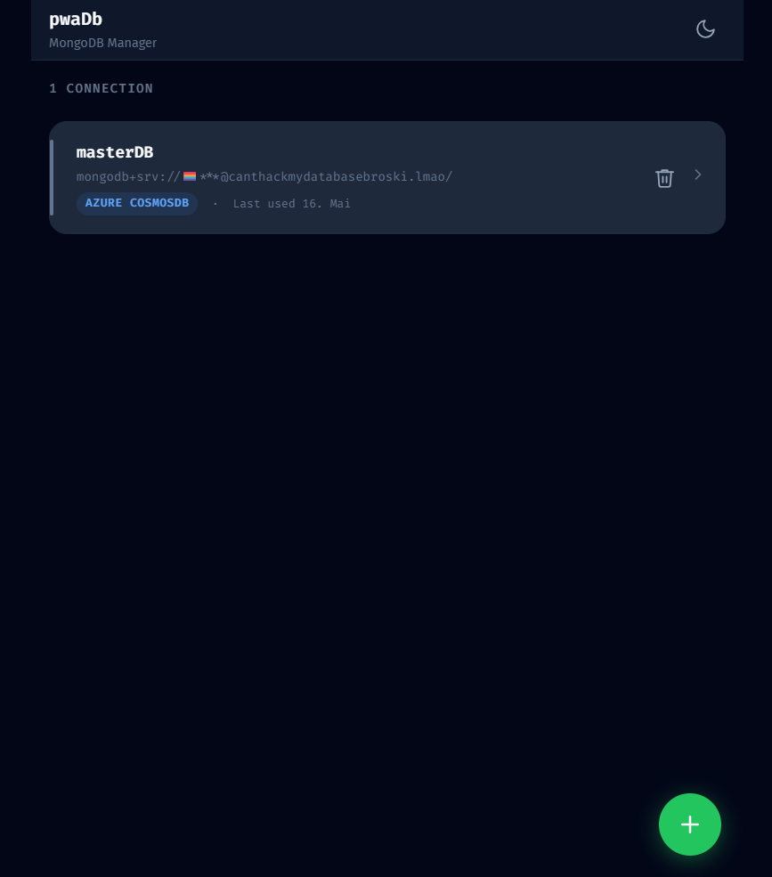

bro the only app on iphone that supports azure cosmosdb mongoDB compatible is mongoLime and it's 399.000VND ... so AI made one for me :) thanks gemini.

# Introduction

A PWA web app to connect to any MongoDB-compatible database.

**Note:** The MongoDB connection string is sent to the server to establish a connection, but is **not** stored on the server.



# Features

- Light / dark mode
- Connect to any MongoDB-compatible database (Atlas, Azure CosmosDB, AWS DocumentDB, standard)
- Easy to use
- Free (and it works)

# Instruction

```bash
git clone https://github.com/freshebred/dbtool.git
cd dbtool
npm install
npm run start
```

Access at http://localhost:3001

## Deploy to subdirectory (e.g. cPanel)

Set the `BASE_PATH` environment variable to your subdirectory path:

```bash
BASE_PATH=/dbtool npm run start
```
